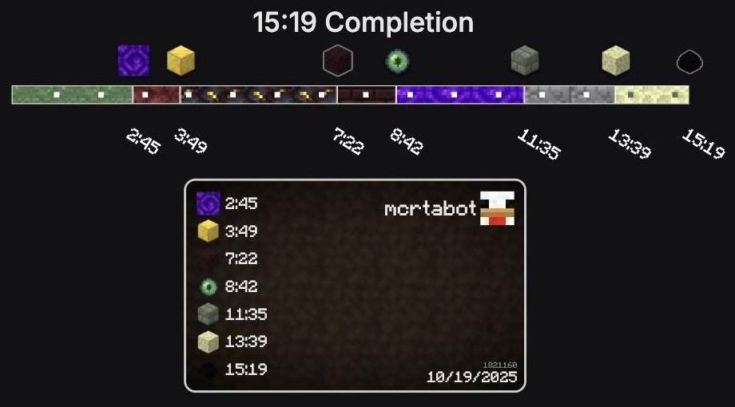
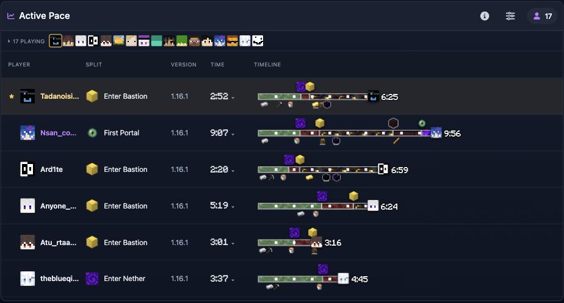

**English** · [日本語](README.ja.md)

# MCSR Timeline for PaceMan

A Chrome / Firefox extension that lets you read a run by its shape instead of its
numbers, right on [paceman.gg](https://paceman.gg/).



The colors are the biomes. A long nether, stuck at the fortress, a comeback at the end
— the shape of the run is right there, no subtracting split times in your head.

## What you get

**A `TIMELINE` column on the front page.**
Everyone currently on pace, on one screen. Live runs walk a head marker along the bar
with the time ticking beside it, and the faces of everyone running sit above the table.



**Also**

- Star a runner and they stay pinned at the top, name in amber, easy to spot
- Click a split icon and the VOD jumps to that moment
- `Image Builder ↗` under the bar opens the run in
  [MCSRImageBuilder](https://mcrtabot.github.io/MCSRImageBuilder/) already filled in,
  ready to save as an image

## Install

There is no Chrome Web Store listing. Grab a build from
[Releases](https://github.com/mcrtabot/paceman-timeline-extension/releases).

**Chrome / Edge**

1. Download `paceman-timeline-extension-<version>-chrome.zip` and unzip it
2. Put the folder somewhere permanent — **the extension loads from it every time, so
   moving or deleting the folder breaks it**
3. Open `chrome://extensions`, turn on **Developer mode**, click **Load unpacked** and
   pick the folder

**Firefox**

1. Download `paceman-timeline-extension-<version>-firefox.zip` and unzip it
2. Open `about:debugging#/runtime/this-firefox`, click **Load Temporary Add-on** and
   pick `manifest.json` inside the folder — this one is removed when Firefox restarts

Then open any run on paceman.gg.

**There is no auto-update.** To update, download the new release, replace the folder
contents, and press reload on `chrome://extensions`.

## Settings

Click the extension's toolbar button. Changes apply to open tabs immediately.

| Section | |
| --- | --- |
| **Enabled** | One switch for the whole extension. Off means paceman.gg exactly as it ships |
| **Show on** | Turn the timeline off per page |
| **Favorites** | The pinned runners, with an × to drop one |
| **Active Pace** | Row order, and the strip of everyone currently running |
| **Appearance** | Split icons, time font, split time angle, context markers |

Context markers — lava bucket, blaze rod and the like, drawn under the bar — only ever
appear on runs that are **currently live**. PaceMan returns them from its live endpoint
alone, so finished runs and history show none even with the setting on.

## If the timeline stops appearing

The extension finds its place by looking for specific elements, and when paceman.gg
changes its markup that search can fail. It then draws nothing rather than guessing.
**The page itself keeps working** — nothing PaceMan renders is replaced or removed, so
a broken extension is invisible rather than destructive.

Please open an issue with the URL if that happens; it usually means the selectors need
updating.

## Development

```
pnpm install
pnpm dev         # dev harness at http://localhost:5173/src/dev/index.html
pnpm build       # writes dist/chrome and dist/firefox
pnpm test        # golden tests against captured fixtures
pnpm typecheck
```

The harness runs offline against real data captured from paceman.gg, so rate limits and
live-data churn stay out of the loop:

- **Gallery** — finished / live / fortress-first / died-in-nether / merged runs
- **Panels** — the list and history panels with a replaceable clock (stop, 1x, 10x,
  60x, 300x), so a live run can be watched growing deterministically
- **Anchors / mount** — the real mount code against a captured DOM skeleton, with
  buttons for double mount, React removal and SPA navigation

`fixtures/` holds those captures. The tests assert shape and anchors, never the values
of live data.

**[DESIGN.md](DESIGN.md)** covers why things are built the way they are: the IGT/RTA
split, how a live run's position is estimated, why nothing mounts inside a React-owned
node, and the scaling rules for each page.

## License

MIT for the code — see [`LICENSE`](LICENSE). It does not cover the files under
`assets/`.

Minecraft is a trademark of Mojang Synergies AB. This project is not an official
Minecraft product and is not approved by or associated with Mojang Studios or
Microsoft.

The timeline rendering logic is ported from
[MCSRImageBuilder](https://github.com/mcrtabot/MCSRImageBuilder), by the same author.
